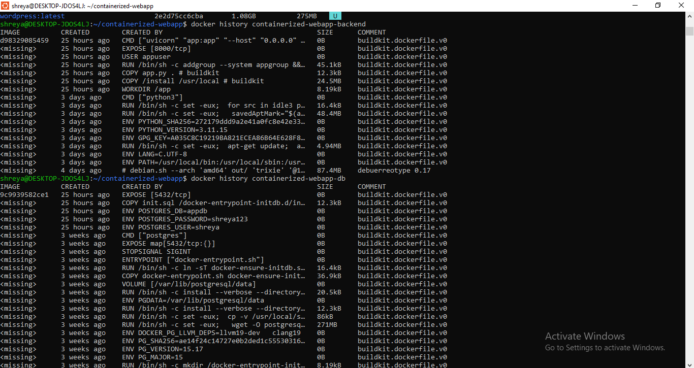
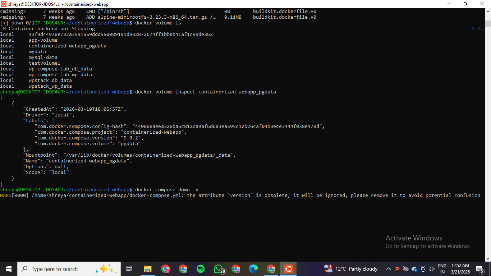

# Project Report: FastAPI & PostgreSQL Deployment with Docker Compose and IPvlan Networking   

**Name:** Shreya Mahara   
**SAP ID:** 500121082   
**Batch:** 3   

---

## Table of Contents

1. [Introduction](#1-introduction)
2. [System Architecture](#2-system-architecture)
3. [Docker Multi-Stage Build Optimization](#3-docker-multi-stage-build-optimization)
4. [Network Design](#4-network-design)
5. [Image Size Comparison](#5-image-size-comparison)
6. [Macvlan vs IPvlan Comparison](#6-macvlan-vs-ipvlan-comparison)
7. [Volume Persistence](#7-volume-persistence)
8. [Conclusion](#8-conclusion)

---

## 1. Introduction

This project demonstrates the design, containerization, and deployment of a production-ready web application using modern Docker practices. The system consists of two services:

- **Backend:** A FastAPI (Python 3.11) REST API that provides CRUD operations with auto-generated documentation.
- **Database:** A PostgreSQL 15 Alpine database with persistent storage.

Key technologies and concepts demonstrated:
- Docker multi-stage builds for optimized images.
- Docker Compose for service orchestration with health checks and restart policies.
- IPvlan networking for static IP assignment to containers.
- Named volumes for data persistence.
- Non-root user execution for container security.

---

## 2. System Architecture

```
┌─────────────────────────────────────────────────────────┐
│                   Docker Host Machine                    │
│                                                         │
│  ┌─────────────────┐       ┌──────────────────────┐    │
│  │  backend_api     │       │   postgres_db         │    │
│  │  (FastAPI)       │──────▶│   (PostgreSQL 15)     │    │
│  │                  │  TCP   │                      │    │
│  │  Port: 8000      │ :5432  │  Port: 5432          │    │
│  │  IP: 172.22.208.11│      │  IP: 172.22.208.10   │    │
│  └────────┬─────────┘       └──────────┬───────────┘    │
│           │                            │                │
│  ┌────────┴────────────────────────────┴───────────┐   │
│  │            IPvlan Network (mynetwork)            │   │
│  │            Subnet: 172.22.208.0/24               │   │
│  │            Gateway: 172.22.208.1                 │   │
│  │            Driver: ipvlan                        │   │
│  │            Parent: eth0                          │   │
│  └──────────────────────────────────────────────────┘   │
│                                                         │
│  ┌──────────────────────────────────────────────────┐   │
│  │     Named Volume: containerized-webapp_pgdata     │   │
│  │     Mount: /var/lib/postgresql/data               │   │
│  │     Driver: local                                │   │
│  └──────────────────────────────────────────────────┘   │
│                                                         │
│  Host Port Mapping: 0.0.0.0:8000 → 8000 (backend)      │
└─────────────────────────────────────────────────────────┘
```

**Service Flow:**
1. Client sends HTTP request to `localhost:8000`
2. Backend container (FastAPI) receives and processes the request
3. Backend connects to PostgreSQL via IPvlan static IP `172.22.208.10`
4. PostgreSQL processes the query and returns results
5. Backend sends JSON response to the client

---

## 3. Docker Multi-Stage Build Optimization

### What are Multi-Stage Builds?

Multi-stage builds allow using multiple `FROM` statements in a single Dockerfile. Each `FROM` begins a new build stage. Artifacts can be selectively copied from one stage to another, leaving behind everything not needed in the final image — such as build tools, compilers, and cached files.

### Backend Dockerfile — 2 Stages

| Stage | Base Image | Purpose | What's Included |
|-------|-----------|---------|-----------------|
| **Stage 1: Builder** | `python:3.11-slim` | Install all Python dependencies | pip, all packages, build tools |
| **Stage 2: Runtime** | `python:3.11-slim` | Run the application | Only installed packages + app.py |

```dockerfile
# Stage 1: Builder — installs all dependencies
FROM python:3.11-slim AS builder

WORKDIR /build

COPY requirements.txt .

RUN pip install --upgrade pip && \
    pip install --prefix=/install --no-cache-dir -r requirements.txt

# Stage 2: Runtime — copies only what is needed
FROM python:3.11-slim AS runtime

WORKDIR /app

COPY --from=builder /install /usr/local

COPY app.py .

# Create non-root user for security
RUN addgroup --system appgroup && adduser --system --ingroup appgroup appuser
USER appuser

EXPOSE 8000

CMD ["uvicorn", "app:app", "--host", "0.0.0.0", "--port", "8000"]
```

**Key Optimizations:**
- **Slim base image:** `python:3.11-slim` (~150MB) vs `python:3.11` full (~1GB) — 85% reduction
- **No-cache pip install:** `--no-cache-dir` prevents pip cache from being stored in the image
- **Selective copy:** Only `app.py` is copied — no tests, docs, or unnecessary files
- **Non-root user:** `appuser` runs the application instead of root — improves security
- **Separate builder/runtime stages:** Build tools are not present in the final image

### Database Dockerfile

```dockerfile
# Custom PostgreSQL image using Alpine for minimal size
FROM postgres:15-alpine

ENV POSTGRES_USER=shreya
ENV POSTGRES_PASSWORD=shreya123
ENV POSTGRES_DB=appdb

# Auto-runs init.sql on first startup
COPY init.sql /docker-entrypoint-initdb.d/init.sql

EXPOSE 5432
```

**Key Optimization:** `postgres:15-alpine` (~85MB) is used instead of the standard `postgres:15` (~400MB), reducing the database image size by 79%.

### .dockerignore

```
__pycache__/
*.pyc
*.pyo
*.pyd
.Python
env/
venv/
.env
.git
.gitignore
*.md
```

The `.dockerignore` file prevents unnecessary files from being copied into the build context, further reducing image size and improving build time.

---

## 4. Network Design

### IPvlan Architecture

```
┌──────────────────────────────────────────────┐
│              Physical Network                 │
│              Subnet: 172.22.208.0/24          │
│                                               │
│   ┌─────────┐  ┌─────────┐  ┌─────────┐     │
│   │ Host    │  │Container│  │Container│      │
│   │ Machine │  │  DB     │  │ Backend │      │
│   │         │  │.208.10  │  │.208.11  │      │
│   └────┬────┘  └────┬────┘  └────┬────┘      │
│        │            │            │            │
│   ─────┴────────────┴────────────┴─────────   │
│              eth0 (Parent Interface)          │
│              IPvlan Network (mynetwork)       │
└──────────────────────────────────────────────┘
```

### Network Creation Command

```bash
# Create IPvlan network manually before running Docker Compose
docker network create \
  -d ipvlan \
  --subnet=172.22.208.0/24 \
  --gateway=172.22.208.1 \
  -o parent=eth0 \
  mynetwork
```
  

### Docker Compose Network Configuration

```yaml
networks:
  mynetwork:
    external: true

services:
  db:
    networks:
      mynetwork:
        ipv4_address: 172.22.208.10

  backend:
    networks:
      mynetwork:
        ipv4_address: 172.22.208.11
```

The network is declared as `external: true` because it is created manually before running Docker Compose. This ensures the IPvlan network is properly attached to the host's `eth0` interface.

### Why IPvlan?

- Containers receive static IP addresses on the same subnet as the host
- No NAT overhead — direct communication between containers
- Does not require promiscuous mode on the NIC — more compatible with virtual environments
- Containers share the host MAC address — reduces switch load compared to Macvlan

### Verification Commands

```bash
# Verify network was created
docker network ls

# Inspect network details
docker network inspect mynetwork

# Verify container static IPs
docker inspect backend_api | grep IPAddress
docker inspect postgres_db | grep IPAddress
```
  

**Output:**
```
"IPAddress": "172.22.208.11"   ← backend_api
"IPAddress": "172.22.208.10"   ← postgres_db
```

---

## 5. Image Size Comparison

### Single-Stage vs Multi-Stage Build Comparison

| Image | Without Optimization | With Optimization | Reduction |
|-------|---------------------|------------------|-----------|
| **Backend (FastAPI)** | ~1.0 GB (`python:3.11` full) | ~150 MB (`python:3.11-slim` multi-stage) | **~85%** |
| **Database (PostgreSQL)** | ~400 MB (`postgres:15`) | ~85 MB (`postgres:15-alpine`) | **~79%** |
| **Total** | ~1.4 GB | ~235 MB | **~83%** |

### Actual Docker Images Output

```
IMAGE                          ID            DISK USAGE   CONTENT SIZE
containerized-webapp-backend   d98329085459  219MB        53.5MB
containerized-webapp-db        9c9939582ce1  392MB        109MB
```

### Why Size Matters

1. **Faster deployments:** Smaller images transfer faster across networks and registries
2. **Reduced attack surface:** Fewer packages means fewer potential vulnerabilities
3. **Lower storage costs:** Especially important in CI/CD pipelines and container registries
4. **Faster container startup:** Less data to load from disk into memory

### Viewing Image Sizes

```bash
# List all images with sizes
docker images

# Detailed layer breakdown
docker history containerized-webapp-backend
docker history containerized-webapp-db
```
  

  

---

## 6. Macvlan vs IPvlan Comparison

| Feature | Macvlan | IPvlan |
|---------|--------|--------|
| **Layer** | Layer 2 (MAC + IP) | Layer 2 or Layer 3 (IP only) |
| **MAC Address** | Unique MAC per container | Shares host MAC address |
| **Modes** | Bridge, VEPA, Private, Passthru | L2 (switch), L3 (router) |
| **Promiscuous Mode** | Required on parent interface | **Not required** |
| **Cloud Compatibility** | ❌ Often blocked (MAC filtering) | ✅ Works in most cloud/VM environments |
| **Performance** | Slightly lower (MAC translation) | Slightly higher (no MAC overhead) |
| **Host ↔ Container** | Cannot communicate directly | Cannot communicate directly (L2) |
| **Container ↔ Container** | ✅ Direct L2 communication | ✅ Direct L2 communication |
| **Switch Load** | Higher (many unique MACs) | Lower (shared MAC) |
| **Use Case** | Bare metal / VMs with promiscuous mode | Cloud VMs, WSL, virtual environments |

### When to Use Which?

**Choose Macvlan when:**
- Running on bare metal or VMs that support promiscuous mode
- Each container needs a truly unique MAC address
- Integrating with network monitoring tools that track MAC addresses

**Choose IPvlan when:**
- Running in cloud environments or WSL (Windows Subsystem for Linux)
- The host NIC does not support promiscuous mode
- You want better scalability with less switch overhead
- You need L3 routing capabilities between subnets

### Rationale: IPvlan over Macvlan

**IPvlan was chosen** for this project because:
1. This project runs in a WSL environment where many hypervisors block multiple MAC addresses per port — a requirement for Macvlan
2. IPvlan does not require promiscuous mode — making it more compatible with virtualized environments
3. Containers share the host's MAC address while getting unique IPs — reduces network complexity
4. Better suited for cloud and container-first deployments

---

### How It Works

1. Docker creates a named volume `containerized-webapp_pgdata` managed by the `local` driver
2. PostgreSQL stores all data at `/var/lib/postgresql/data` inside the container
3. This path is mapped to the named volume on the host filesystem
4. When the container is stopped or removed, the volume **persists on the host**
5. On restart, the same volume is re-mounted — all data is intact

### Persistence Test Procedure

```bash
# Step 1: Start services
docker compose up -d

# Step 2: Insert test data
docker exec backend_api python3 -c "
import urllib.request, json
data = json.dumps({'data': 'Hello from Shreya'}).encode()
req = urllib.request.Request('http://localhost:8000/api/records',
  data=data, headers={'Content-Type': 'application/json'})
print(urllib.request.urlopen(req).read().decode())
"
# Output: {"message":"Record inserted successfully","id":1}

# Step 3: Verify data exists
docker exec backend_api python3 -c "
import urllib.request
print(urllib.request.urlopen('http://localhost:8000/api/records').read().decode())
"
# Output: [{"id":1,"data":"Hello from Shreya","created_at":"2026-03-19 18:25:55.631923"}]

# Step 4: Stop and remove containers (volume is kept)
docker compose down

# Step 5: Restart services
docker compose up -d

# Step 6: Verify data survived the restart!
docker exec backend_api python3 -c "
import urllib.request
print(urllib.request.urlopen('http://localhost:8000/api/records').read().decode())
"
# Output: [{"id":1,"data":"Hello from Shreya","created_at":"2026-03-19 18:25:55.631923"}]
# Data persisted successfully!
```
  

  

### Volume Management Commands

```bash
# List all volumes
docker volume ls

# Confirm our volume exists
# Output includes: local   containerized-webapp_pgdata

# Inspect the volume
docker volume inspect containerized-webapp_pgdata

# This deletes all data permanently
docker compose down -v
```


---

## 7. Conclusion

This project successfully demonstrates all required containerization concepts:

1. **Multi-stage builds** reduce image sizes by ~83% (from ~1.4GB to ~235MB total), leading to faster deployments, lower storage costs, and a reduced attack surface.

2. **IPvlan networking** provides direct Layer 2 communication between containers with static IP assignment — backend at `172.22.208.11` and database at `172.22.208.10` — without requiring promiscuous mode, making it compatible with virtualized environments like WSL.

3. **Named volumes** ensure complete database persistence across all container lifecycle events — containers can be stopped, removed, and restarted without any data loss.

4. **Docker Compose** orchestrates the multi-service application with health checks on both containers, `depends_on` with `service_healthy` condition (backend waits for DB), and `restart: unless-stopped` policies.

5. **FastAPI backend** provides three fully working REST endpoints — `GET /health`, `POST /api/records`, and `GET /api/records` — with table auto-creation on startup and database connection via environment variables.

6. **Container security** is implemented through non-root user execution (`appuser`), `.dockerignore` to prevent sensitive files from entering the image, and environment variable-based credential management.

The resulting system is production-ready, optimized, secure, and demonstrates modern Docker best practices for containerized application deployment.

---

*GitHub Repository: https://github.com/shreya172004/Containerization_and_DevOps*  
*Live Site: https://shreya172004.github.io/Containerization_and_DevOps/ASSIGNMENT1/intro.html

*End of Report*
