# FastAPI & PostgreSQL Deployment with Docker Compose and IPvlan Networking         

---

**Name:** Shreya Mahara         
**Batch:** 3                   
**Sap-Id:** 500121082                

---

## Project Overview

This project demonstrates how to design, containerize, and deploy a production-ready web application using Docker. The application uses:

- **Backend API:** FastAPI (Python 3.11) — chosen for its async performance and auto-generated API docs
- **Database:** PostgreSQL 15
- **Orchestration:** Docker Compose with health checks and restart policies
- **Networking:** Docker IPvlan — containers assigned static IPs on the host network
- **Storage:** Docker Named Volume for persistent database storage
- **Image Optimization:** Multi-stage builds, slim/alpine base images, non-root user, `.dockerignore`

> IPvlan was chosen over Macvlan because it allows containers to share the host MAC address — reducing switch load and making it more suitable for virtualized/cloud environments.

---

## Architecture & Network Design

```
Client (Browser / Postman)
          │
          │ HTTP Requests
          ▼
  Backend Container (FastAPI)
  IP: 172.22.208.11 | Port: 8000
  Image: python:3.11-slim (multi-stage)
          │
          │ PostgreSQL Connection via IPvlan Static IP
          ▼
  Database Container (PostgreSQL 15)
  IP: 172.22.208.10 | Port: 5432
  Image: postgres:15-alpine
          │
          ▼
  Docker Named Volume (containerized-webapp_pgdata)
  Persistent Storage — survives container restarts
```

---

## Tech Stack Comparison

| Component | My Project | Why Better |
|---|---|---|
| Backend | FastAPI (Python 3.11) | Async, modern, auto API docs at /docs |
| Database | PostgreSQL 15 Alpine | Lighter than standard postgres:15 |
| Build | Multi-stage (builder + runtime) | Final image ~150MB vs ~1GB |
| Networking | IPvlan | More scalable than Macvlan in VMs |
| Security | Non-root user (appuser) | Hardened container |
| DB init | Dockerfile + init.sql | Custom image, not default postgres |

---

## Prerequisites

Verify Docker is installed:

```bash
$ docker --version
$ docker compose version

```


---

## Step-by-Step Setup

### Step 1 — Create Project Directory

```bash
$ mkdir containerized-webapp
$ cd containerized-webapp
$ mkdir backend database screenshots
```

### Step 2 — Create All Project Files

```bash
$ nano backend/app.py
$ nano backend/requirements.txt
$ nano backend/Dockerfile
$ nano backend/.dockerignore
$ nano database/Dockerfile
$ nano database/init.sql
$ nano docker-compose.yml
$ nano .gitignore
```
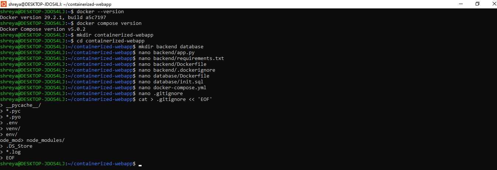

---

## backend/app.py

```python
from fastapi import FastAPI
from pydantic import BaseModel
import psycopg2
import os
import time

app = FastAPI(title="Containerized Web App", version="1.0.0")

DB_HOST = os.getenv("DB_HOST", "db")
DB_PORT = os.getenv("DB_PORT", "5432")
DB_NAME = os.getenv("DB_NAME", "appdb")
DB_USER = os.getenv("DB_USER", "shreya")
DB_PASS = os.getenv("DB_PASS", "shreya123")

def get_connection():
    retries = 5
    while retries > 0:
        try:
            conn = psycopg2.connect(
                host=DB_HOST, port=DB_PORT,
                dbname=DB_NAME, user=DB_USER, password=DB_PASS
            )
            return conn
        except psycopg2.OperationalError:
            retries -= 1
            time.sleep(2)
    raise Exception("Could not connect to database.")

def init_db():
    conn = get_connection()
    cur = conn.cursor()
    cur.execute("""
        CREATE TABLE IF NOT EXISTS records (
            id SERIAL PRIMARY KEY,
            data TEXT NOT NULL,
            created_at TIMESTAMP DEFAULT CURRENT_TIMESTAMP
        )
    """)
    conn.commit()
    cur.close()
    conn.close()

@app.on_event("startup")
def startup_event():
    init_db()

class RecordIn(BaseModel):
    data: str

@app.get("/health")
def health_check():
    return {"status": "healthy", "service": "fastapi-backend"}

@app.post("/api/records")
def insert_record(record: RecordIn):
    conn = get_connection()
    cur = conn.cursor()
    cur.execute("INSERT INTO records (data) VALUES (%s) RETURNING id", (record.data,))
    new_id = cur.fetchone()[0]
    conn.commit()
    cur.close()
    conn.close()
    return {"message": "Record inserted successfully", "id": new_id}

@app.get("/api/records")
def fetch_records():
    conn = get_connection()
    cur = conn.cursor()
    cur.execute("SELECT id, data, created_at FROM records ORDER BY id")
    rows = cur.fetchall()
    cur.close()
    conn.close()
    return [{"id": r[0], "data": r[1], "created_at": str(r[2])} for r in rows]
```

---

## backend/requirements.txt

```
fastapi==0.110.0
uvicorn==0.29.0
psycopg2-binary==2.9.9
pydantic==2.6.4
```

---

## backend/Dockerfile (Multi-Stage Build)

```dockerfile
# Stage 1: Builder — installs all dependencies
FROM python:3.11-slim AS builder

WORKDIR /build

COPY requirements.txt .

RUN pip install --upgrade pip && \
    pip install --prefix=/install --no-cache-dir -r requirements.txt

# Stage 2: Runtime — copies only what is needed
FROM python:3.11-slim AS runtime

WORKDIR /app

COPY --from=builder /install /usr/local

COPY app.py .

# Create non-root user for security
RUN addgroup --system appgroup && adduser --system --ingroup appgroup appuser
USER appuser

EXPOSE 8000

CMD ["uvicorn", "app:app", "--host", "0.0.0.0", "--port", "8000"]
```

---

## backend/.dockerignore

```
__pycache__/
*.pyc
*.pyo
*.pyd
.Python
env/
venv/
.env
.git
.gitignore
*.md
```

---

## database/Dockerfile

```dockerfile
# Custom PostgreSQL image using Alpine for minimal size
FROM postgres:15-alpine

ENV POSTGRES_USER=shreya
ENV POSTGRES_PASSWORD=shreya123
ENV POSTGRES_DB=appdb

# Auto-runs init.sql on first startup
COPY init.sql /docker-entrypoint-initdb.d/init.sql

EXPOSE 5432
```

---

## database/init.sql

```sql
DO $$ BEGIN
  CREATE USER shreya WITH PASSWORD 'shreya123';
EXCEPTION WHEN duplicate_object THEN
  RAISE NOTICE 'User already exists, skipping.';
END $$;

GRANT ALL PRIVILEGES ON DATABASE appdb TO shreya;

\connect appdb;

CREATE TABLE IF NOT EXISTS records (
    id SERIAL PRIMARY KEY,
    data TEXT NOT NULL,
    created_at TIMESTAMP DEFAULT CURRENT_TIMESTAMP
);

GRANT ALL PRIVILEGES ON ALL TABLES IN SCHEMA public TO shreya;
GRANT ALL PRIVILEGES ON ALL SEQUENCES IN SCHEMA public TO shreya;
```

---

## docker-compose.yml

```yaml
version: "3.9"

services:

  db:
    build:
      context: ./database
      dockerfile: Dockerfile
    container_name: postgres_db
    environment:
      POSTGRES_USER: shreya
      POSTGRES_PASSWORD: shreya123
      POSTGRES_DB: appdb
    volumes:
      - pgdata:/var/lib/postgresql/data
    networks:
      mynetwork:
        ipv4_address: 172.22.208.10
    restart: unless-stopped
    healthcheck:
      test: ["CMD-SHELL", "pg_isready -U shreya -d appdb"]
      interval: 10s
      timeout: 5s
      retries: 5

  backend:
    build:
      context: ./backend
      dockerfile: Dockerfile
    container_name: backend_api
    environment:
      DB_HOST: 172.22.208.10
      DB_PORT: 5432
      DB_NAME: appdb
      DB_USER: shreya
      DB_PASS: shreya123
    ports:
      - "8000:8000"
    networks:
      mynetwork:
        ipv4_address: 172.22.208.11
    depends_on:
      db:
        condition: service_healthy
    restart: unless-stopped
    healthcheck:
      test: ["CMD-SHELL", "curl -f http://localhost:8000/health || exit 1"]
      interval: 15s
      timeout: 5s
      retries: 3

volumes:
  pgdata:
    name: containerized-webapp_pgdata

networks:
  mynetwork:
    external: true
```

---

## Step 3 — Create IPvlan Network

IPvlan allows containers to get static IPs on the same subnet as the host, sharing the host's MAC address. This makes it more scalable than Macvlan in virtualized environments.

```bash
$ docker network create -d ipvlan --subnet=172.22.208.0/24 --gateway=172.22.208.1 -o parent=eth0  mynetwork

```
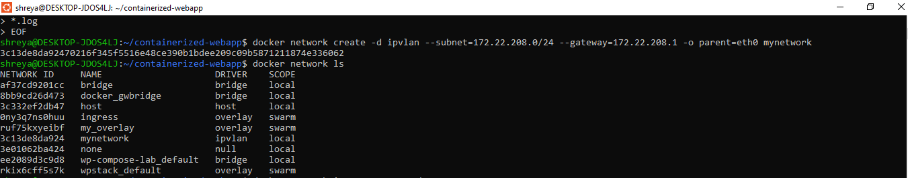

### Verify Network

```bash
$ docker network ls

```
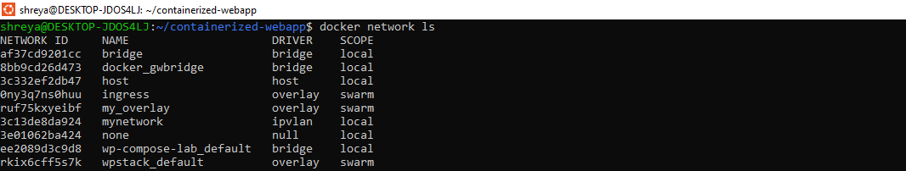 

### Inspect Network

```bash
$ docker network inspect mynetwork
```
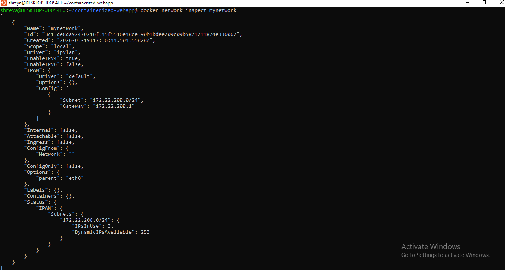

---

## Step 4 — Build and Start Containers

```bash
$ docker compose up --build
```
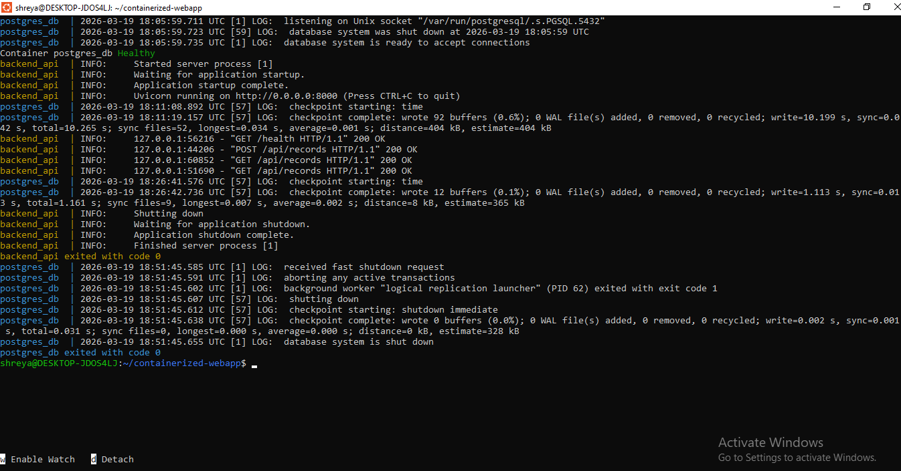

---

## Step 5 — Verify Running Containers

```bash
$ docker ps
```
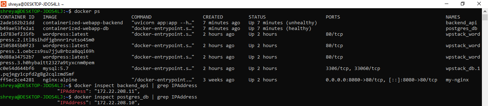 

---

## Step 6 — Verify Static IP Addresses

```bash
$ docker inspect backend_api | grep IPAddress
"IPAddress": "172.22.208.11"

$ docker inspect postgres_db | grep IPAddress
"IPAddress": "172.22.208.10"
```
 

---

## Step 7 — Test API Endpoints

### Health Check

```bash
$ docker exec backend_api python3 -c "import urllib.request;  \print(urllib.request.urlopen('http://localhost:8000/health').read().decode())"
```
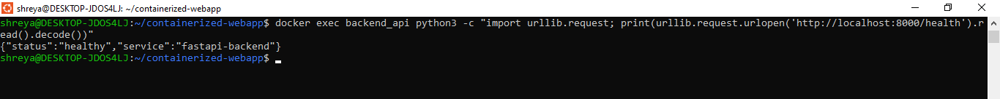 

### Insert Record (POST)

```bash
$ docker exec backend_api python3 -c "
import urllib.request, json
data = json.dumps({'data': 'Hello from Shreya'}).encode()
req = urllib.request.Request(
  'http://localhost:8000/api/records',
  data=data,
  headers={'Content-Type': 'application/json'}
)
print(urllib.request.urlopen(req).read().decode())
"
```

### Fetch All Records (GET)

```bash
$ docker exec backend_api python3 -c \
  "import urllib.request; \
  print(urllib.request.urlopen('http://localhost:8000/api/records').read().decode())"
```
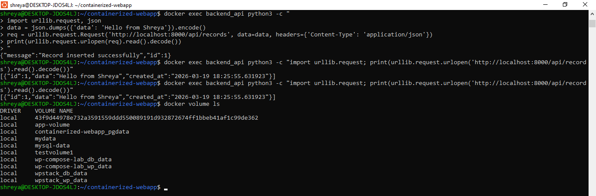 

---

## Step 8 — Verify Docker Images

```bash
$ docker images
```
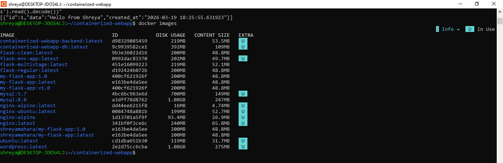 

> Backend image is only **53.5** thanks to multi-stage build with python:3.11-slim. A standard python:3.11 image would be ~1GB.

---

## Step 9 — Volume Persistence Test

### Stop Containers

```bash
$ docker compose down
```
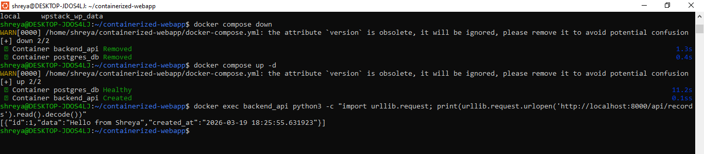 

### Restart Containers

```bash
$ docker compose up -d
```


### Fetch Records Again — Data Still Exists ✅

```bash
$ docker exec backend_api python3 -c \
  "import urllib.request; \
  print(urllib.request.urlopen('http://localhost:8000/api/records').read().decode())"
```


### Verify Volume

```bash
$ docker volume ls
```
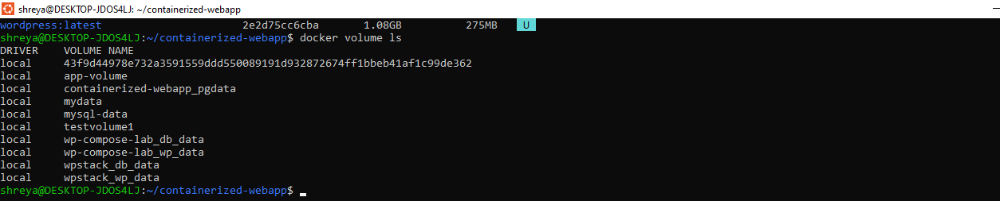

---

## Image Size Optimization

| Base Image | Size | Used In |
|---|---|---|
| python:3.11 | ~1.0 GB | ❌ Too large |
| python:3.11-slim (multi-stage) | ~150 MB | ✅ Backend |
| postgres:15 | ~400 MB | ❌ Too large |
| postgres:15-alpine | ~85 MB | ✅ Database |

### Optimizations Applied

- **Multi-stage build** — builder stage installs deps; runtime stage copies only the result
- **Slim/Alpine base images** — reduces final image size by ~85%
- **.dockerignore** — excludes `__pycache__`, `.env`, `.git` from build context
- **Non-root user** — `appuser` created and used in backend container for security
- **Chained RUN commands** — minimizes number of image layers

---

## IPvlan vs Macvlan Comparison

| Feature | Macvlan | IPvlan |
|---|---|---|
| MAC Address | Each container gets a unique MAC | Containers share the host MAC |
| Network Load | Higher (switch tracks many MACs) | Lower |
| Scalability | Limited by switch MAC table size | Highly scalable |
| Host Isolation | Host cannot reach containers | Host can communicate |
| Best Use Case | Small LAN / bare metal | Cloud / VMs ✅ Used here |

**Why IPvlan was chosen in our application:** In virtualized environments (like WSL/cloud VMs), many network interfaces block multiple MAC addresses per port. IPvlan avoids this by sharing the host MAC, making it the correct choice for this setup.

---

## Docker Compose Features Used

| Feature | Purpose |
|---|---|
| `depends_on: condition: service_healthy` | Backend waits for DB to be fully ready |
| `healthcheck` on both services | Ensures containers are actually functional |
| `restart: unless-stopped` | Auto-restarts on failure — production-ready |
| `external: true` network | IPvlan network created manually before compose |
| Named volume `pgdata` | Data persists across container restarts |
| Environment variables | Securely passes DB credentials to containers |

---

## Conclusion

This project successfully implements all required components:

- ✅ **FastAPI backend** — modern Python API with POST, GET, and health endpoints
- ✅ **PostgreSQL 15** — custom Dockerfile with Alpine base and auto-init script
- ✅ **Multi-stage Docker build** — final image reduced from ~1GB to ~150MB
- ✅ **Docker Compose orchestration** — health checks, restart policies, depends_on
- ✅ **IPvlan networking** — static IPs: backend `172.22.208.11`, DB `172.22.208.10`
- ✅ **Named volume persistence** — data survives complete container restarts
- ✅ **Non-root user** — improved container security
- ✅ **Table auto-creation** — DB schema initialized on startup without manual steps

## 📝 Report

See [REPORT.md](./REPORT.md) for the detailed project report including:
- Build optimization explanation
- Network design diagram
- Image size comparison
- Macvlan vs IPvlan comparison
