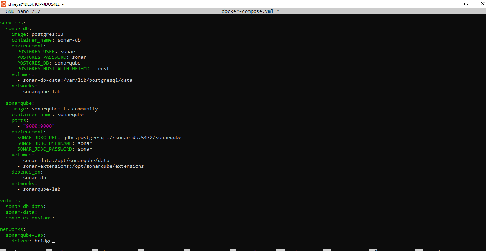

# **Experiment 10: SonarQube — Static Code Analysis**


## Name: Shreya Mahara  
Roll no: R2142231007   
Sap-ID: 500121082    
School of Computer Science,

University of Petroleum and Energy Studies, Dehradun

---
## Objective

Perform static code analysis on a Java application using SonarQube to automatically detect bugs, security vulnerabilities, and code smells — and understand how it integrates into a CI/CD pipeline.

---

## Theory

### Problem Statement
Code bugs and security issues are often found too late — during testing or even after deployment. Manual code reviews are slow, inconsistent, and don't scale as teams grow.

### What is SonarQube?
SonarQube is an open-source platform that automatically scans source code for bugs, security vulnerabilities, and maintainability issues — **without running the code**. This is called **static analysis**.

### Key Terms

| Term | Meaning |
|------|---------|
| **Quality Gate** | A set of rules; code must pass before deployment |
| **Bug** | Code that will likely break or behave incorrectly |
| **Vulnerability** | A security weakness in the code |
| **Code Smell** | Code that works but is poorly written or hard to maintain |
| **Technical Debt** | Estimated time to fix all issues |
| **Coverage** | Percentage of code tested by unit tests |
| **Duplication** | Repeated code blocks (copy-paste) |

### Lab Architecture

```
┌─────────────────────────────────────────────────────────┐
│                    Your Machine / CI                    │
│                                                         │
│   ┌──────────────┐        ┌──────────────────────────┐  │
│   │  Your Code   │──────▶ │    Sonar Scanner         │  │
│   │  (Java, JS,  │ scans  │  (CLI / Maven / Jenkins) │  │
│   │   Python...) │        └────────────┬─────────────┘  │
│   └──────────────┘                     │ sends report   │
│                                        ▼                │
│                          ┌─────────────────────────┐    │
│                          │   SonarQube Server      │    │
│                          │   (runs on port 9000)   │    │
│                          │   ┌─────────────────┐   │    │
│                          │   │ Analysis Engine │   │    │
│                          │   │ Quality Gates   │   │    │
│                          │   │ Web Dashboard   │   │    │
│                          │   └────────┬────────┘   │    │
│                          └───────────┼─────────────┘    │
│                                      │ stores results   │
│                          ┌───────────▼─────────────┐    │
│                          │   PostgreSQL Database   │    │
│                          └─────────────────────────┘    │
└─────────────────────────────────────────────────────────┘
```

---

## Prerequisites

- Docker Desktop installed and running
- Maven (`mvn`) installed (or use the Docker-based scanner)
- Terminal / command line

Check Docker is running:

```bash
docker --version
docker-compose --version
```

---

## Step 1: Start the SonarQube Server

Navigate to the experiment folder and start all containers:

```bash
cd ~/Desktop/exp10
docker-compose up -d
```

Watch logs until you see **"SonarQube is operational"**:

```bash
docker-compose logs -f sonarqube
```


Verify containers are running:

```bash
docker ps
```

**Expected:** Two containers — `sonarqube` and `sonar-db` — both with status `Up`.


---

## Step 2: Open SonarQube Dashboard

Open your browser and go to:

```
http://localhost:9000
```

- Default credentials: **admin / admin**
- You will be prompted to change the password on first login (set it to something like `admin123`)


---

## Step 3: Generate an Authentication Token

The scanner needs a token to authenticate with the server.

1. Click your **user icon** (top right) → **My Account**
2. Click the **"Security"** tab
3. Under **"Generate Tokens"**, type a name: `scanner-token`
4. Click **"Generate"**
5. **Copy the token immediately** — it is shown only once!


Now export the token as an environment variable in your terminal (replace with your actual token):

```bash
export SONAR_TOKEN=sqp_xxxxxxxxxxxxxxxxxxxxxxxxxxxxxxxx
```

---

## Step 4: Create the Sample Java Application

The project files are already created under `sample-java-app/`. Here is what each file contains:

### `src/main/java/com/example/Calculator.java`

A Java class intentionally containing:
- **Bug:** Division by zero (unhandled)
- **Code Smell:** Unused variable
- **Vulnerability:** SQL Injection risk
- **Code Smell:** Duplicated `multiply()` and `multiplyAlt()` methods
- **Bug:** Null pointer risk in `getName()`
- **Code Smell:** Empty catch block in `riskyOperation()`

### `pom.xml`

Maven build file with the SonarQube Maven plugin (`sonar-maven-plugin 3.9.1.2184`) configured.

---

## Step 5: Update the Token in pom.xml

Replace `YOUR_TOKEN_HERE` in `pom.xml` with your actual token:

```bash
cd ~/Desktop/exp10/sample-java-app
sed -i '' "s/YOUR_TOKEN_HERE/$SONAR_TOKEN/" pom.xml
```

Verify the replacement:

```bash
grep "sonar.login" pom.xml
```

---

## Step 6: Run the SonarQube Scan

### Option A — Maven Plugin (Recommended if Maven is installed)

```bash
cd ~/Desktop/exp10/sample-java-app
mvn sonar:sonar -Dsonar.login=$SONAR_TOKEN
```

Maven will compile the code and send the analysis report to the SonarQube server.


### Option B — Docker-based Scanner CLI (No Maven needed)

First, find the exact Docker network name:

```bash
docker network ls | grep sonarqube
```

Then run the scanner container:

```bash
cd ~/Desktop/exp10/sample-java-app

docker run --rm \
  --network exp10_sonarqube-lab \
  -e SONAR_TOKEN="$SONAR_TOKEN" \
  -v "$(pwd):/usr/src" \
  sonarsource/sonar-scanner-cli \
  -Dsonar.host.url=http://sonarqube:9000 \
  -Dsonar.projectBaseDir=/usr/src \
  -Dsonar.projectKey=sample-java-app
```

> **Note:** Use `http://sonarqube:9000` (container name), **not** `localhost`, because the scanner container is on the same Docker network as the server.


---

## Step 7: View Results in the Dashboard

After the scan finishes, open:

```
http://localhost:9000/dashboard?id=sample-java-app
```


---

## Step 8: Jenkins Integration (CI/CD — Reference)

Once SonarQube is working locally, it can be added to a Jenkins pipeline so every code commit is automatically scanned.

```groovy
// Jenkinsfile
pipeline {
    agent any
    environment {
        SONAR_HOST_URL = 'http://sonarqube:9000'
        SONAR_TOKEN = credentials('sonar-token')
    }
    stages {
        stage('Checkout') {
            steps { checkout scm }
        }
        stage('SonarQube Analysis') {
            steps {
                withSonarQubeEnv('SonarQube') {
                    sh 'mvn clean verify sonar:sonar'
                }
            }
        }
        stage('Quality Gate') {
            steps {
                timeout(time: 5, unit: 'MINUTES') {
                    waitForQualityGate abortPipeline: true
                }
            }
        }
        stage('Build') {
            steps { sh 'mvn package' }
        }
        stage('Deploy') {
            steps {
                sh 'docker build -t sample-app .'
                sh 'docker run -d -p 8080:8080 sample-app'
            }
        }
    }
}
```


**Pipeline flow:**


---


## Tool Comparison Matrix

| Feature | Jenkins | Ansible | Chef | SonarQube |
|---------|---------|---------|------|-----------|
| Primary Purpose | CI/CD Automation | Config Management | Config Management | Code Quality |
| Architecture | Master-Agent | Agentless | Client-Server | Client-Server |
| Language | Java / Groovy | YAML | Ruby | Java |
| Learning Curve | Moderate | Low | High | Low |
| Setup Complexity | Moderate | Simple | Complex | Simple |

---

## Key Concepts Summary

- **SonarQube Server** = The brain — receives, stores, and displays analysis results
- **Sonar Scanner** = The worker — reads your code and sends the report to the server
- **Both are required.** The Scanner needs a Token to talk to the Server
- **Quality Gates** automatically block bad code from being deployed

---

## Best Practices

- **Security:** Never hardcode tokens — use environment variables or a secrets manager
- **Code Quality:** Set Quality Gates to block merges when coverage drops below 80%
- **Scan on every pull request**, not just nightly builds
- **Fix issues as they appear** — do not let technical debt accumulate
- **Version all config files in Git**
