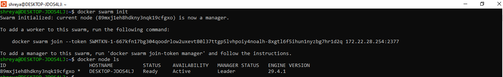
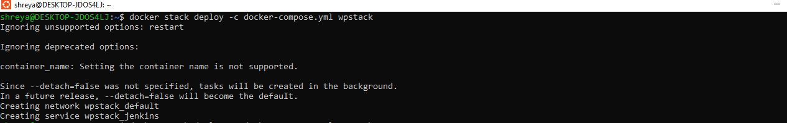
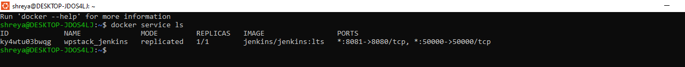
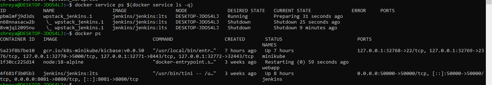
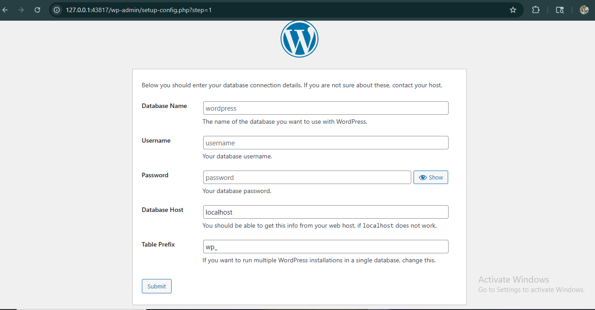

# **Experiment 11: Study and Analyse Container Orchestration using Kubernetes**


## Name: Shreya Mahara  
Roll no: R2142231007   
Sap-ID: 500121082    
School of Computer Science,

University of Petroleum and Energy Studies, Dehradun

---

## Objective

Understand container orchestration by moving from Docker Compose to Docker Swarm. Learn how to deploy a stack, scale services, and observe self-healing in a Docker Swarm cluster using WordPress and MySQL setup.


## Prerequisites

- Docker installed with Swarm mode enabled
- The `docker-compose.yml` file from Experiment 6 (WordPress + MySQL)


## PART B – PRACTICAL (EXTENSION OF EXPERIMENT 6)


### Task 1: Initialize Docker Swarm

Swarm mode turns your current machine into a manager node of a cluster.

```bash
docker swarm init
```

Verify that your node is ready as a Swarm manager:

```bash
docker node ls
```



### Task 3: Deploy as a Stack (Not Just Compose)

In Swarm, we deploy a stack using the same Compose file. Swarm reads the file and creates services, which manage the containers automatically.

```bash
docker stack deploy -c docker-compose.yml wpstack
```



### Task 4: Verify the Deployment

List all services in the stack:

```bash
docker service ls
```


See detailed tasks (containers) for a specific service:

```bash
docker service ps wpstack_wordpress
```

See all running containers (notice they are managed by Swarm):

```bash
docker ps
```



### Task 5: Access WordPress

Open your browser and navigate to:
`http://localhost:8081`

You should see the WordPress setup screen.



---

### Task 6: Scale the Application (Swarm's Superpower)

Scale WordPress from 1 to 3 replicas using Swarm's orchestration.

```bash
docker service scale wpstack_wordpress=3
```


Verify the scaling:

```bash
docker service ls
docker service ps wpstack_wordpress
docker ps | grep wordpress
```


*Note: Swarm automatically balances traffic among all 3 containers on port 8081 without port conflicts.*


### Task 7: Test Self-Healing (Automatic Recovery)

Swarm automatically replaces failed containers. Let's test it:

**Step 1:** Find a WordPress container ID.
```bash
docker ps | grep wordpress
```

**Step 2:** Kill it to simulate a crash (replace `<container-id>`):
```bash
docker kill <container-id>
```

**Step 3:** Watch Swarm recreate it automatically:
```bash
docker service ps wpstack_wordpress
docker ps | grep wordpress
```


*Notice the killed container is shut down, and a new container is automatically created to maintain 3 replicas.*


### Task 8: Remove the Stack

Clean up the deployed stack and verify removal:

```bash
docker stack rm wpstack
docker service ls
docker ps
```
