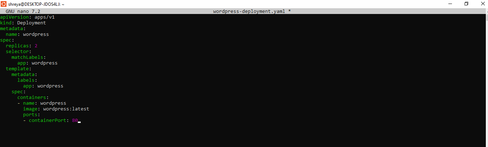
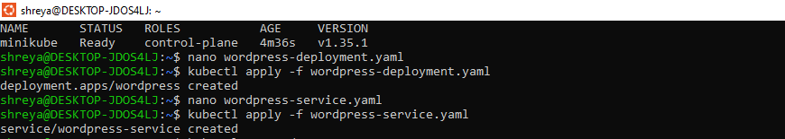
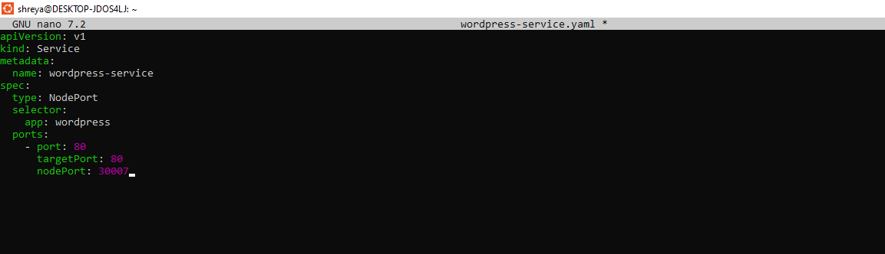
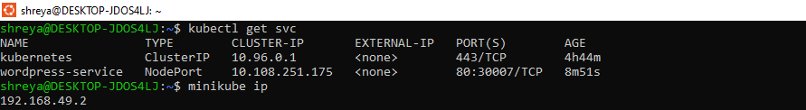
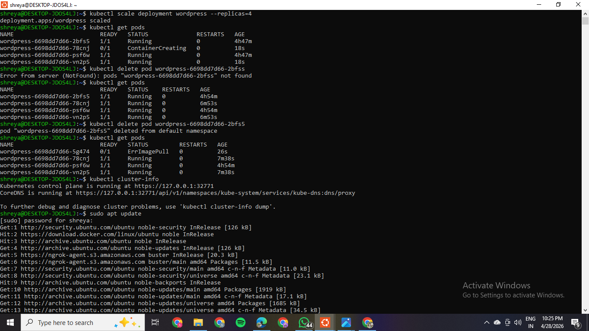
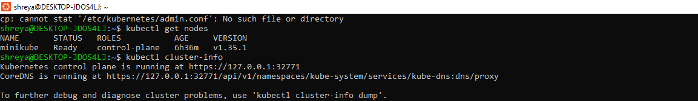
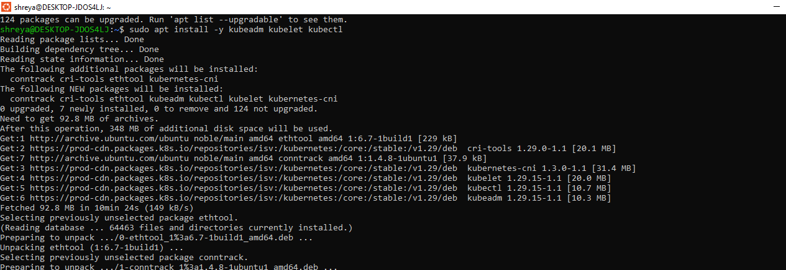
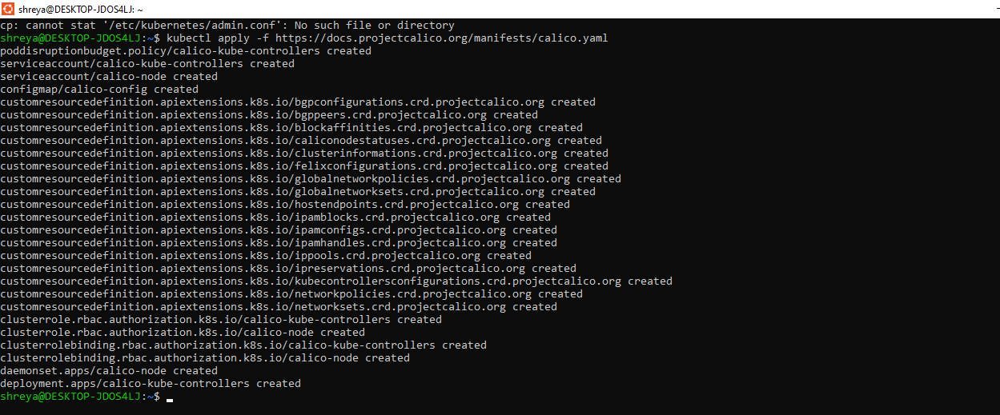

# **Experiment 12: Study and Analyse Container Orchestration using Kubernetes**


## Name: Shreya Mahara  
Roll no: R2142231007   
Sap-ID: 500121082    
School of Computer Science,

University of Petroleum and Energy Studies, Dehradun

---

## Objective

Learn why Kubernetes is used, its basic concepts, and how to deploy, scale, and fix apps using Kubernetes commands.

---

## Why Kubernetes over Docker Swarm?

| Reason | Explanation |
|--------|-------------|
| Industry standard | Most companies use Kubernetes |
| Powerful scheduling | Automatically decides where to run your app |
| Large ecosystem | Many tools and plugins available |
| Cloud-native support | Works on AWS, Google Cloud, Azure, etc. |

---

## Core Kubernetes Concepts (Simple Explanation)

| Docker Concept | Kubernetes Equivalent | What it means |
|---------------|----------------------|----------------|
| Container | Pod | A pod is a group of one or more containers. Smallest unit in K8s. |
| Compose service | Deployment | Describes how your app should run (e.g., 2 copies, which image to use) |
| Load balancing | Service | Exposes your app to the outside world or other pods |
| Scaling | ReplicaSet | Ensures a certain number of pod copies are always running |

---

## Hands-On Lab (Using k3d or Minikube)

> **Note:** We assume you already have `kubectl` and a cluster (k3d or Minikube) installed.

---

## PART A – Core Tasks

### Task 1: Create a Deployment

A deployment tells Kubernetes:
- Which container image to use (e.g., WordPress)
- How many copies (replicas) to run
- How to identify the pods (labels)

**Step 1:** Create the file `wordpress-deployment.yaml`

```yaml
# wordpress-deployment.yaml
apiVersion: apps/v1          # Which Kubernetes API to use
kind: Deployment             # Type of resource
metadata:
  name: wordpress            # Name of this deployment
spec:
  replicas: 2                # Run 2 identical pods
  selector:
    matchLabels:
      app: wordpress         # Pods with this label belong to this deployment
  template:                  # Template for the pods
    metadata:
      labels:
        app: wordpress       # Label applied to each pod
    spec:
      containers:
      - name: wordpress
        image: wordpress:latest   # Docker image
        ports:
        - containerPort: 80       # Port inside the container
```

**Step 2:** Apply the deployment

```bash
kubectl apply -f wordpress-deployment.yaml
```

> **What happens?** Kubernetes creates 2 pods running WordPress.



---

### Task 2: Expose the Deployment as a Service

Pods are temporary (they can be deleted or recreated). A Service gives them a fixed IP and exposes them to the outside.

**Step 1:** Create the file `wordpress-service.yaml`

```yaml
# wordpress-service.yaml
apiVersion: v1
kind: Service
metadata:
  name: wordpress-service
spec:
  type: NodePort            # Exposes service on a port of each node (VM)
  selector:
    app: wordpress          # Send traffic to pods with this label
  ports:
    - port: 80              # Service port
      targetPort: 80        # Pod port
      nodePort: 30007       # External port (range: 30000-32767)
```
  

**Step 2:** Apply the service

```bash
kubectl apply -f wordpress-service.yaml
```


---

### Task 3: Verify Everything

**Check if pods are running:**

```bash
kubectl get pods
```


**Check the service:**

```bash
kubectl get svc
```


**Access WordPress in your browser:**

```
http://localhost:30007
```

- **Minikube:** Usually `minikube ip`


- **k3d:** Usually `localhost`


---

### Task 4: Scale the Deployment

Increase the number of pods from 2 to 4:

```bash
kubectl scale deployment wordpress --replicas=4
```
Verify:

```bash
kubectl get pods
```



> You should now see 4 running pods.

> **Why scale?** More traffic → more copies → better performance.


---

### Task 5: Self-Healing Demonstration

Kubernetes automatically replaces failed pods.

**Step 1:** Get pod names

```bash
kubectl get pods
```

**Step 2:** Delete one pod (replace `<pod-name>`):

```bash
kubectl delete pod <pod-name>
```

**Step 3:** Check pods again:

```bash
kubectl get pods
```

> You will still see 4 pods — the deleted one was **automatically recreated**.

> **Why?** The deployment ensures the desired number (4) is always running.


---

## PART B – Cluster Information

```bash
kubectl get nodes
kubectl cluster-info
```


---

## PART C – Swarm vs Kubernetes (Comparison)

| Feature | Docker Swarm | Kubernetes |
|---------|-------------|------------|
| Setup | Very easy | More complex |
| Scaling | Basic | Advanced (auto-scaling) |
| Ecosystem | Small | Huge (monitoring, logging) |
| Industry use | Rare | Standard |

> **Verdict:** Learn Kubernetes — it's what companies use.

---

## PART D – Advanced Lab: Real Cluster with kubeadm

### Lab Requirements
- 2 or 3 virtual machines (e.g., VirtualBox, VMware)
- Ubuntu 22.04 or 24.04
- Each VM: 2+ CPU, 2+ GB RAM

### High-Level Steps

**Step 1:** Install `kubeadm`, `kubelet`, `kubectl` on all nodes

```bash
# Update system
sudo apt update

# Install required packages
sudo apt install -y apt-transport-https ca-certificates curl

# Add Kubernetes signing key
curl -fsSL https://pkgs.k8s.io/core:/stable:/v1.29/deb/Release.key | \
  sudo gpg --dearmor -o /etc/apt/keyrings/kubernetes-apt-keyring.gpg

# Add Kubernetes repository
echo 'deb [signed-by=/etc/apt/keyrings/kubernetes-apt-keyring.gpg] \
  https://pkgs.k8s.io/core:/stable:/v1.29/deb/ /' | \
  sudo tee /etc/apt/sources.list.d/kubernetes.list

# Install kubeadm, kubelet, kubectl
sudo apt update
sudo apt install -y kubeadm kubelet kubectl

# Hold versions to prevent auto-update
sudo apt-mark hold kubeadm kubelet kubectl
```



**Step 2:** Initialize the control plane (master node only)

```bash
sudo kubeadm init
```

This command:
- Sets up the control plane
- Generates a token for worker nodes to join
- Takes 2–3 minutes

**Step 3:** Set up kubeconfig (to use `kubectl`)

```bash
# Create .kube directory for your user
mkdir -p $HOME/.kube

# Copy admin config
sudo cp /etc/kubernetes/admin.conf $HOME/.kube/config

# Fix permissions
sudo chown $(id -u):$(id -g) $HOME/.kube/config
```

Now you can run `kubectl get nodes` to see the master.

**Step 4:** Install a network plugin (required for pods to communicate)

```bash
kubectl apply -f https://docs.projectcalico.org/manifests/calico.yaml
```


Wait 1–2 minutes for Calico to start.

**Step 5:** Join worker nodes

After `kubeadm init`, you'll see a join command like:

```bash
kubeadm join 192.168.1.100:6443 --token abcdef.0123456789abcdef \
    --discovery-token-ca-cert-hash sha256:...
```

Run that exact command on each worker node.

**Step 6:** Verify the cluster (on master)

```bash
kubectl get nodes
```

Expected output:
```
NAME       STATUS   ROLES           AGE   VERSION
master     Ready    control-plane   5m    v1.29.0
worker1    Ready    <none>          2m    v1.29.0
worker2    Ready    <none>          2m    v1.29.0
```

---

## Summary of Commands (Cheat Sheet)

| Goal | Command |
|------|---------|
| Apply a YAML file | `kubectl apply -f file.yaml` |
| See all pods | `kubectl get pods` |
| See all services | `kubectl get svc` |
| Scale a deployment | `kubectl scale deployment <name> --replicas=N` |
| Delete a pod | `kubectl delete pod <pod-name>` |
| See all nodes | `kubectl get nodes` |
| Cluster info | `kubectl cluster-info` |

---

## Conclusion

In this experiment, we:

- Understood basic Kubernetes concepts (Pods, Deployments, Services, ReplicaSets)
- Deployed WordPress using a **Deployment** and **Service**
- **Scaled** the deployment from 2 to 4 replicas
- Demonstrated **self-healing** by deleting a pod and watching it auto-recover
- Compared **Docker Swarm** vs **Kubernetes**
- Learned how to build a real production-style cluster with `kubeadm`

**Next step:** Try deploying your own custom app (e.g., a simple Node.js or Python app).
