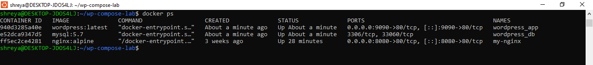
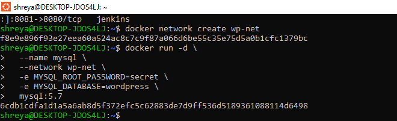
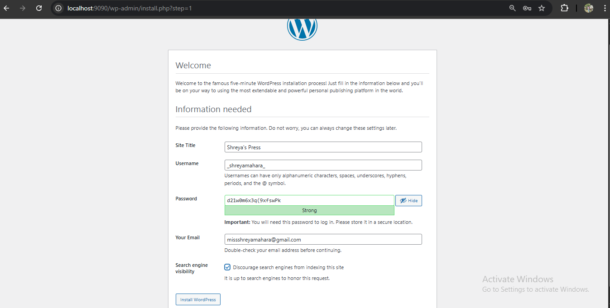
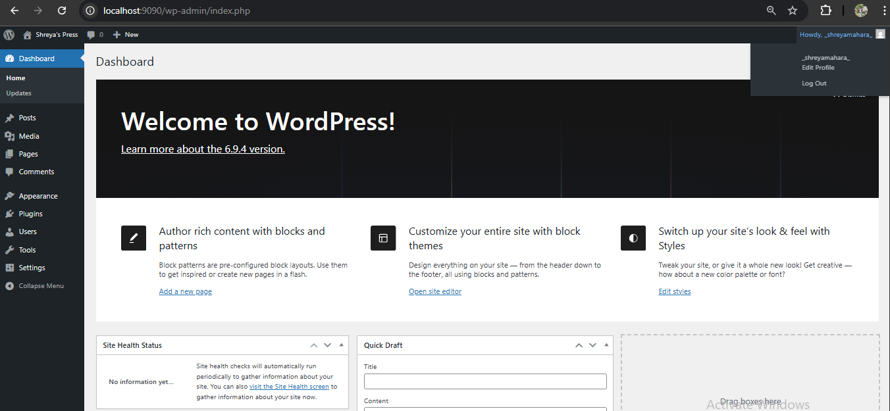
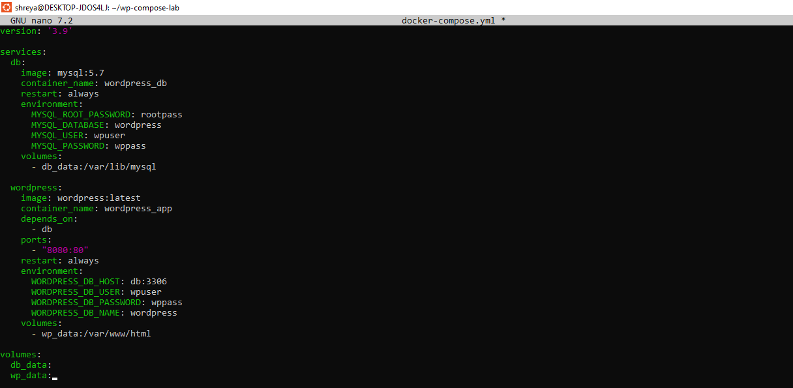
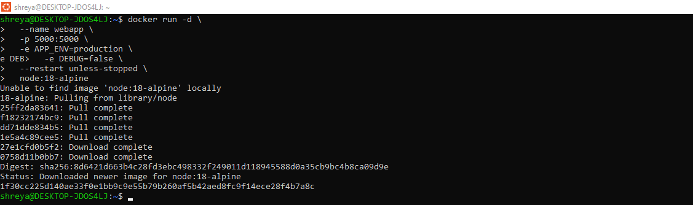
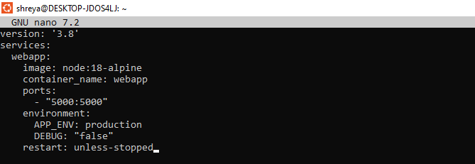
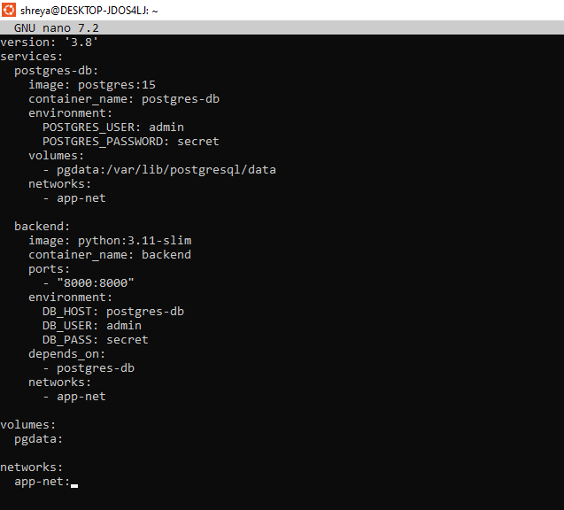

 ** Experiment 6: Comparison of Docker Run and Docker Compose **

## Name: Shreya Mahara  
Roll no: R2142231007   
Sap-ID: 500121082    
School of Computer Science,

University of Petroleum and Energy Studies, Dehradun
---

##  Objective

To understand the relationship between `docker run` and Docker Compose, and to compare their configuration syntax and use cases by deploying single-container and multi-container applications.

---

##  PART A – Theory

### 1. Docker Run (Imperative Approach)

The `docker run` command creates and starts a container from an image. It requires explicit flags for port mapping (`-p`), volume mounting (`-v`), environment variables (`-e`), network configuration (`--network`), restart policies (`--restart`), resource limits (`--memory`, `--cpus`), and container name (`--name`).

**Example:**
```bash
docker run -d \
  --name my-nginx \
  -p 8080:80 \
  -v ./html:/usr/share/nginx/html \
  -e NGINX_HOST=localhost \
  nginx:alpine
```


### 2. Docker Compose (Declarative Approach)

Docker Compose uses a YAML file (`docker-compose.yml`) to define services, networks, and volumes in a structured format. Instead of multiple commands, a single command is used: `docker compose up -d`

**Equivalent Compose file:**
```yaml
version: '3.8'
services:
  nginx:
    image: nginx:alpine
    container_name: my-nginx
    ports:
      - "8080:80"
    volumes:
      - ./html:/usr/share/nginx/html
    environment:
      NGINX_HOST: localhost
    restart: unless-stopped
```

### 3. Mapping: Docker Run vs Docker Compose

| Docker Run Flag | Docker Compose Equivalent |
|---|---|
| `-p 8080:80` | `ports:` |
| `-v host:container` | `volumes:` |
| `-e KEY=value` | `environment:` |
| `--name` | `container_name:` |
| `--network` | `networks:` |
| `--restart` | `restart:` |
| `--memory` | `deploy.resources.limits.memory` |
| `--cpus` | `deploy.resources.limits.cpus` |
| `-d` | `docker compose up -d` |

### 4. Advantages of Docker Compose

1. Simplifies multi-container applications
2. Provides reproducibility
3. Version controllable configuration
4. Unified lifecycle management
5. Supports service scaling: `docker compose up --scale web=3`

---

## 🧪 PART B – Practical Implementation

---

### Task 1: Single Container Comparison

---

#### Step 1: Run Nginx Using Docker Run

**Command:**
```bash
docker run -d \
  --name lab-nginx \
  -p 8081:80 \
  -v $(pwd)/html:/usr/share/nginx/html \
  nginx:alpine
```


**Verify container is running:**
```bash
docker ps
```


---

#### Step 2: Run Same Setup Using Docker Compose

**Create `docker-compose.yml`:**
```yaml
version: '3.8'
services:
  nginx:
    image: nginx:alpine
    container_name: lab-nginx
    ports:
      - "8081:80"
    volumes:
      - ./html:/usr/share/nginx/html
```

**Run container:**
```bash
docker compose up -d
```
**Verify:**
```bash
docker compose ps
```


---

**Stop containers:**
```bash
docker compose down
```
##### Command Explanation:Docker compose down: Stop and remove all services, networks (but preserves volumes)
---

### Task 2: Multi-Container Application — WordPress + MySQL

---

#### Part A: Using Docker Run (Manual Method)

**Step 1: Create network:**
```bash
docker network create wp-net
```
**Step 2: Run MySQL container:**
```bash
docker run -d \
  --name mysql \
  --network wp-net \
  -e MYSQL_ROOT_PASSWORD=secret \
  -e MYSQL_DATABASE=wordpress \
  mysql:5.7
```


**Step 3: Run WordPress container:**
```bash
docker run -d \
  --name wordpress \
  --network wp-net \
  -p 8082:80 \
  -e WORDPRESS_DB_HOST=mysql \
  -e WORDPRESS_DB_PASSWORD=secret \
  wordpress:latest
```


**Verify both containers running:**
```bash
docker ps
```


**Access in browser:** `http://localhost:8082`

**📸 Screenshot – WordPress installation page (via Docker Run):**



> *The WordPress installation page loads at `http://localhost:8082`, confirming both the MySQL and WordPress containers are running and communicating via the `wp-net` Docker network.*

---

#### Part B: Using Docker Compose (Structured Method)

**Create `docker-compose.yml`:**
```yaml
version: '3.8'
services:
  mysql:
    image: mysql:5.7
    environment:
      MYSQL_ROOT_PASSWORD: secret
      MYSQL_DATABASE: wordpress
    volumes:
      - mysql_data:/var/lib/mysql

  wordpress:
    image: wordpress:latest
    ports:
      - "8082:80"
    environment:
      WORDPRESS_DB_HOST: mysql
      WORDPRESS_DB_PASSWORD: secret
    depends_on:
      - mysql

volumes:
  mysql_data:
```


**Start application:**
```bash
docker compose up -d
```
**Verify:**
```bash
docker ps
```

**Access in browser:** `http://localhost:8082`

**📸 Screenshot – WordPress page via Docker Compose:**


**Stop and remove everything:**
```bash
docker compose down -v
```

---

## 🔄 PART C – Conversion & Build-Based Tasks

---

### Task 3: Convert Docker Run to Docker Compose

---

#### Problem 1: Basic Web Application

**Given Docker Run command:**
```bash
docker run -d \
  --name webapp \
  -p 5000:5000 \
  -e APP_ENV=production \
  -e DEBUG=false \
  --restart unless-stopped \
  node:18-alpine
```


**Equivalent `docker-compose.yml`:**
```yaml
version: '3.8'
services:
  webapp:
    image: node:18-alpine
    container_name: webapp
    ports:
      - "5000:5000"
    environment:
      APP_ENV: production
      DEBUG: "false"
    restart: unless-stopped
```


**Run:**
```bash
docker compose up -d
```

**Verify:**
```bash
docker compose ps
```

---

#### Problem 2: Volume + Network Configuration

**Given Docker Run commands:**
```bash
docker network create app-net

docker run -d \
  --name postgres-db \
  --network app-net \
  -e POSTGRES_USER=admin \
  -e POSTGRES_PASSWORD=secret \
  -v pgdata:/var/lib/postgresql/data \
  postgres:15

docker run -d \
  --name backend \
  --network app-net \
  -p 8000:8000 \
  -e DB_HOST=postgres-db \
  -e DB_USER=admin \
  -e DB_PASS=secret \
  python:3.11-slim
```

**Equivalent `docker-compose.yml`:**
```yaml
version: '3.8'
services:
  postgres-db:
    image: postgres:15
    container_name: postgres-db
    environment:
      POSTGRES_USER: admin
      POSTGRES_PASSWORD: secret
    volumes:
      - pgdata:/var/lib/postgresql/data
    networks:
      - app-net

  backend:
    image: python:3.11-slim
    container_name: backend
    ports:
      - "8000:8000"
    environment:
      DB_HOST: postgres-db
      DB_USER: admin
      DB_PASS: secret
    depends_on:
      - postgres-db
    networks:
      - app-net

volumes:
  pgdata:

networks:
  app-net:
```


**Run:**
```bash
docker compose up -d
```

**Stop and remove:**
```bash
docker compose down -v
```

---

## 📊 Comparison: Docker Run vs Docker Compose

| Feature | Docker Run | Docker Compose |
|---|---|---|
| Approach | Imperative | Declarative |
| Configuration | Command line flags | YAML file |
| Multi-container support | Complex (manual) | Easy (`depends_on`) |
| Reusability | Low | High |
| Version control | Difficult | Easy (commit YAML) |
| Networking | Manual (`--network`) | Auto-created |
| Volumes | Manual (`-v`) | Defined in YAML |
| Scaling | Not supported | `--scale` flag |

---

##  Result

Successfully completed:
-  Nginx container using Docker Run — verified at `http://localhost:8081`
-  Nginx container using Docker Compose — verified at `http://localhost:8081`
- WordPress + MySQL using Docker Run — verified at `http://localhost:8082`
-  WordPress + MySQL using Docker Compose — verified at `http://localhost:8082`
-  Docker Run to Compose conversion (Problems 1 & 2)
- Resource limits conversion (Task 4)
-  Custom Dockerfile with Compose (Task 5)
-  Multi-stage Dockerfile with Compose (Task 6)

---

##  Viva Questions

**Q1. What is Docker Compose?**
Docker Compose is a tool used to define and run multi-container Docker applications using a YAML configuration file (`docker-compose.yml`).

**Q2. What is the difference between Docker Run and Docker Compose?**
Docker Run executes containers manually using CLI commands (imperative), while Docker Compose manages multiple containers using a declarative YAML configuration file.

**Q3. What does `depends_on` do?**
It ensures that one service starts before another. For example, WordPress waits for MySQL to start before launching.

**Q4. Why are Docker networks used?**
Docker networks allow containers to communicate with each other using container names as hostnames, without exposing ports to the host machine.

**Q5. What is the difference between `image:` and `build:` in Compose?**
`image:` pulls a prebuilt image from Docker Hub, while `build:` builds a custom image from a local Dockerfile.

**Q6. What does `docker compose down -v` do?**
It stops and removes containers, networks, AND named volumes defined in the Compose file.

---

##  Conclusion

Docker Compose provides a structured and efficient way to manage multi-container applications compared to `docker run`. It simplifies deployment, improves maintainability, enables version control of infrastructure, and allows easy scaling of services using a single declarative YAML file.

---


